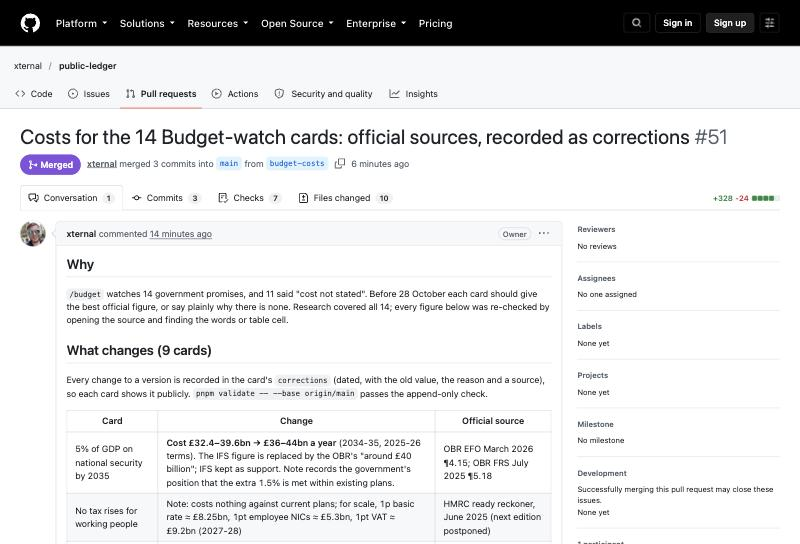
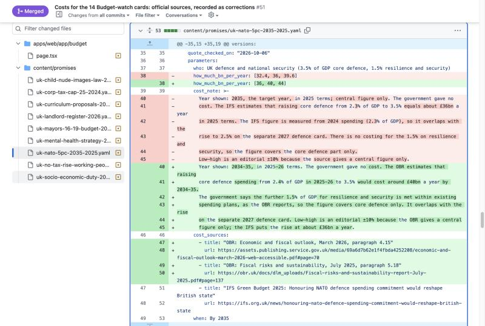
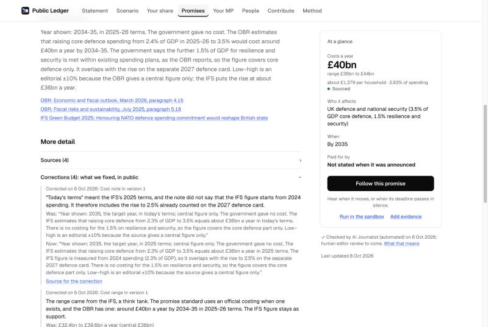

# Editors' guide

Welcome. This is everything a Public Ledger editor needs: what the job is, the rules in plain words, and how to review a card on GitHub step by step. It takes about 20 minutes to read. The full rules are in [PROMISE_STANDARD.md](PROMISE_STANDARD.md); where this guide and the standard differ, the standard wins.

## The job in one paragraph

Every promise on [ledgergov.uk](https://ledgergov.uk) is a card: the exact words, who said them and when, what it would cost a year, who pays, and a timeline that moves only on evidence. Cards and every change to them arrive as pull requests on GitHub. Two editors must approve each one before it counts. Your job is to check each change against its sources and approve it, or send it back with a note. AI Journalist, our automated reviewer, checks every draft first and flags problems, but it never decides: you do. Expect about two hours a week; one card takes 10 to 20 minutes.

## Before your first review

1. **A GitHub account.** Any free account. Tell us its username.
2. **Your declaration.** Email it to editors@ledgergov.uk using the template at the end of this guide. It stays private: we never publish it unless you agree, and it never goes into this repository.
3. **Accept the invitation.** We add you to the repository as a collaborator; GitHub emails you an invitation. Your approvals count only once you have accepted it.
4. **A one-hour call** to walk through a real card together.
5. **Never push to `main`.** Every change goes through a pull request, including your own.

## The rules in plain words

**What counts as a promise.** A statement by someone with power, or seeking it, that commits to a future change we can check. "We will cap bus fares at £2 from January" is a promise. Descriptions of the past, opinions and predictions are not.

**The quote is exact.** The card's quote is copied word for word from its source. If one word differs, it is wrong. `quote_checked_on` records when a person last checked it at the source.

**The four questions.** Who benefits or pays; how much a year; when; and from where (what pays for it). "From where" is recorded exactly as the speaker stated it; if they named nothing, the card says "Funding not stated". That is a fact about the promise, not a judgement.

**Cost.** A range a year, low to high, in £ billions. The speaker's own figure if they gave one; otherwise the best official costing (OBR, HMRC, the Treasury, the department, an impact assessment). Think tanks only as support. A multi-year total is never shown as a yearly figure. If there is only a single figure, the range is an editorial ±10% and the note says so. If there is no official costing, the card says why, and nobody guesses. Every cost also says who made its central figure (`costed_by`): `official` (the OBR, HMRC, the Treasury, another department, a devolved government), `party` (the promise-maker's own figure, even if that party is now in government) or `independent` (the IFS, think tanks, academics).

**Who has to deliver it.** Every card names the body that would have to act to deliver the promise now (`outcome_by`): `hm-government`, the Scottish or Welsh Government, a council. It is a body, never a party or a person. It is `null` when no body in power has committed to it, such as an opposition party's pledge. The same rule for every party; it changes when power changes hands only if the new holders take the promise on or drop it.

**Status moves only on evidence.**

| Status | What moves a card there |
|---|---|
| Promised | The statement itself, archived |
| In plan | An official plan or white paper naming it |
| Legislated | A bill passed or a statutory instrument made |
| Funded | Money allocated in a Budget, Spending Review or estimates line |
| Delivering | Started: a scheme open, payments flowing, contracts signed |
| Delivered | The outcome met as worded (partial delivery stays Delivering) |
| Not met | The deadline passed and evidence shows it was not met, or it was abandoned |
| Undone | The deadline passed with no statement and no evidence of delivery (confirmed by an editor after 30 days) |

Every status change is a new event with a link to its evidence. An announcement alone never moves a card.

**History is append-only.** Nothing published is ever rewritten. A reworded promise gets a new version. A change in the world gets a new event. Only our own mistakes are fixed in place, and each fix is recorded as a correction: the date, the old value, the new value, the reason and a source. Readers see every correction on the card. The automatic checks (CI) fail any pull request that edits history without recording it.

**One standard for everyone.** The same rules, wording and checks for every party, in government or opposition. Headlines are neutral: "Cap bus fares at £2", never "Labour's broken bus pledge".

**Right of reply.** Anyone a card is about may dispute it. Their reply is published next to the card within five working days, with the editors' response.

## How to review a pull request

**1. Open it.** Pull requests waiting for editors are listed at [github.com/xternal/public-ledger/pulls](https://github.com/xternal/public-ledger/pulls). Daily drafts from Parliament are labelled `intake`.

**2. Read the description.** It says why the change is made and lists each card with its source.



**3. Open "Files changed".** Red lines are removed, green lines added. Each card is one file in `content/promises/`. Here the defence card's cost changes from £32.4–39.6bn to £36–44bn a year, with the note and the sources that back it:



**4. Check each card.** Open every source link; don't trust the summary.

- [ ] The quote matches the source word for word, and the speaker and date are right.
- [ ] Each new event has an evidence link, and the evidence really shows what the event says.
- [ ] The status matches the evidence (table above).
- [ ] The cost is a yearly figure from the best official source, and the note says which year it is and how the range was made.
- [ ] `costed_by` names whoever made the central figure, with the right kind: official, party or independent.
- [ ] `outcome_by` is the body that would have to deliver it now, or `null` if no body in power is committed to it.
- [ ] "Funded by" is exactly what the speaker said, or empty if they said nothing.
- [ ] The headline and notes are neutral and say no more than the sources.
- [ ] Any change to something already published has a matching correction.
- [ ] Nothing here would be treated differently if another party had said it.
- [ ] Nothing reads as an accusation against a person. If it might, flag it for a legal check instead of approving.

**5. Comment or ask for changes.** Hover over a line in "Files changed" and press the blue **+** to comment on it. Be specific: "The source says 'by 2028', not 'in 2028'."

**6. Approve.** Press **Review changes** (top right of "Files changed"), choose **Approve**, add a line saying what you checked, and press **Submit review**. A daily intake pull request merges by itself once two editors have approved it and the checks are green. Other pull requests are merged by the owner after two approvals.

**7. If it is about your own party,** don't approve it. Comment "Declaring an interest; leaving this one to another editor" and move on.

## What readers see

Every card shows its cost, sources and timeline, and under **Corrections** every fix we have made, with the old and new values and the reason. Your review is what stands behind that page.



## Reader submissions

Readers send promises and evidence through the site. Editors triage them in the editors' area (`/admin`; the owner gives you the sign-in) within three working days: accept and turn into a draft card or a new event, or turn down with a reason (no primary source, not a promise, a duplicate, out of scope). Editors never see readers' email addresses. A submission is never published without the same two-editor review.

## Budget day

On the day of a Budget many cards can move at once. [BUDGET_DAY.md](BUDGET_DAY.md) is the plan: which documents to read, what each watched card is waiting for, and ready-made entries.

## Help

Ask on the pull request, or email editors@ledgergov.uk. If you're unsure, don't approve; asking is part of the job.

## Your declaration (email it; never commit it)

Copy this into an email to editors@ledgergov.uk:

```
Subject: Editor declaration

Name to credit on the site (or "no credit"):
GitHub username:
Party membership (the party, or "none"):
Political roles now or in the last five years (elected office, candidate, party
or campaign staff), or "none":
Anything else an editor should know (for example, you work for a body we
track), or "none":

I will apply the promise standard to every party in the same way, never approve
a card about my own party, and tell editors@ledgergov.uk if any of this changes.
```

We use it only to run the conflict-of-interest rule, keep it private, and delete it six months after you stop editing ([privacy notice](https://ledgergov.uk/privacy#what)).
